<div align="center">
  
</div>

<br />

<div align="center">
  <a href="https://readme-typing-svg.demolab.com?font=JetBrains+Mono&weight=600&size=22&duration=2800&pause=900&color=58A6FF&center=true&vCenter=true&width=860&lines=Software+Engineer+%40+Wells+Fargo;Software+Engineering+Specialist+%40+xAI;Open+source+and+machine+learning;IIEST+Shibpur+Alum">
    
  </a>
</div>

<div align="center">
  <a href="https://simeetnayan81.github.io">
    
  </a>
  <a href="https://simeetnayan81.github.io/assets/resume.pdf">
    
  </a>
  <a href="https://linkedin.com/in/simeetnayan">
    
  </a>
  <a href="https://x.com/SimeetNayan">
    
  </a>
  <a href="https://medium.com/@simeetnayan81">
    
  </a>
  <a href="https://huggingface.co/simeetnayan">
    
  </a>
  <a href="https://github.com/simeetnayan81">
    
  </a>
</div>

<div align="center">
  
  
  
  <a href="https://ieeexplore.ieee.org/abstract/document/10829434">
    
  </a>
</div>

---

## About

I'm a software engineer at [Wells Fargo](https://www.wellsfargo.com) and a Software Engineering Specialist at [xAI](https://x.ai), working on improving the Grok model.

After hours I work on **open-source machine learning** — training libraries, the systems around models, and on-device ML. I studied Information Technology at [IIEST Shibpur](https://www.iiests.ac.in) (2024).

<table>
  <tr>
    <td width="50%" valign="top">
      <h3>Work</h3>
      <ul>
        <li><a href="https://www.wellsfargo.com"><b>Wells Fargo</b></a> — Software Engineer</li>
        <li><a href="https://x.ai"><b>xAI</b></a> — Software Engineering Specialist, Grok</li>
      </ul>
    </td>
    <td width="50%" valign="top">
      <h3>After hours</h3>
      <ul>
        <li>Open source — PyTorch RL, Ignite, Ray, MLX</li>
        <li>ML systems — environments, retrieval, on-device ML</li>
        <li>Writing and paper implementations</li>
      </ul>
    </td>
  </tr>
</table>

<!--START:IDENTITY-->
```text
whoami     Simeet Nayan · simeetnayan81
role       Software Engineer @ Wells Fargo · Specialist @ xAI
base       Bengaluru, India
focus      open source · machine learning · ML systems
now        VectorSwift  ·  rlx-swift  ·  ODSE
oss        ml-explore/mlx  ·  ml-explore/mlx-swift-examples  ·  ml-explore/mlx-swift  ·  ml-explore/mlx-swift-lm
updated    2026-08-30 07:11 UTC
```
<!--END:IDENTITY-->

---

## Projects

Live cards. Click through for the code.

<div align="center">
  <a href="https://github.com/simeetnayan81/VectorSwift">
    
  </a>
  <a href="https://github.com/simeetnayan81/rlx-swift">
    
  </a>
</div>
<div align="center">
  <a href="https://github.com/simeetnayan81/ODSE">
    
  </a>
  <a href="https://github.com/simeetnayan81/dqn-breakout">
    
  </a>
</div>
<div align="center">
  <a href="https://github.com/simeetnayan81/hypergan-pytorch">
    
  </a>
  <a href="https://github.com/simeetnayan81/finbot">
    
  </a>
</div>

<details>
<summary><b>Recently active</b></summary>

<!--START:RECENT_REPOS-->
- **[VectorSwift](https://github.com/simeetnayan81/VectorSwift)** — Vector database written in Swift, built to run both on personal devices and on Swift server deployments · _Swift · 2★ · updated Aug 13, 2026_
- **[rlx-swift](https://github.com/simeetnayan81/rlx-swift)** — High-performance reinforcement learning environment and data-collection API built in idiomatic Swift. By leveraging MLXArray, rlx-swift delivers seamless, hardware-accelerated training loops optimized directly for Apple Silicon · _Swift · 2★ · updated Jul 10, 2026_
- **[ODSE](https://github.com/simeetnayan81/ODSE)** — Open Data Science Environment (ODSE): A standardized environment for AI agents to master end to end data science pipelines · _Python · 2★ · updated Apr 25, 2026_
- **[dqn-breakout](https://github.com/simeetnayan81/dqn-breakout)** — Implementation of Deep Q Network to play Atari Breakout · _Jupyter Notebook · 1★ · updated Apr 23, 2025_
- **[finbot](https://github.com/simeetnayan81/finbot)** — Finance News Aggregator using Agentic AI (Gemini + AutoGen) · _Python · updated Apr 10, 2025_
- **[RL-Algorithms](https://github.com/simeetnayan81/RL-Algorithms)** — Reinforcement Learning Algorithms Implementation · _Jupyter Notebook · updated Apr 06, 2025_
<!--END:RECENT_REPOS-->

</details>

---

## Open source

Recent public PRs, issues, and commits, grouped by repo. Expands as new work lands.

<details>
<summary><b>Recent contributions</b></summary>

<!--START:RECENT_PRS-->
<details>
<summary><b><a href="https://github.com/ml-explore/mlx">ml-explore/mlx</a></b> · <a href="https://github.com/ml-explore">ml-explore</a> · 3 items</summary>

- [Add TypeError for 0-d mlx scalar when calling iter/list](https://github.com/ml-explore/mlx/pull/4425) · open · Aug 29, 2026
- Commented on [[BUG] Saving a lazily loaded file back to the same path silently corrupts it](https://github.com/ml-explore/mlx/issues/4427#issuecomment-5463910989) · Aug 29, 2026
- Opened issue [[BUG]  0-d iter() / list() throws IndexError: SmallVector out of range instead of TypeError](https://github.com/ml-explore/mlx/issues/4423) · Aug 29, 2026
</details>

<details>
<summary><b><a href="https://github.com/ml-explore/mlx-swift">ml-explore/mlx-swift</a></b> · <a href="https://github.com/ml-explore">ml-explore</a> · 3 items</summary>

- Commented on [[BUG]  convolve(..., mode: .same) wrong right pad for even kernels](https://github.com/ml-explore/mlx-swift/issues/466#issuecomment-5460289601) · Aug 29, 2026
- Opened issue [[BUG]  convolve(..., mode: .same) wrong right pad for even kernels](https://github.com/ml-explore/mlx-swift/issues/466) · Aug 28, 2026
- Commented on [Discussion: Sendable MLXArray](https://github.com/ml-explore/mlx-swift/issues/417#issuecomment-5451634802) · Aug 28, 2026
</details>

<details>
<summary><b><a href="https://github.com/pytorch/rl">pytorch/rl</a></b> · <a href="https://github.com/pytorch">pytorch</a> · 1 item</summary>

- [[Feature, Example] A3C Atari Implementation for TorchRL](https://github.com/pytorch/rl/pull/3001) · open · Aug 26, 2026
</details>

<details>
<summary><b><a href="https://github.com/simeetnayan81/VectorSwift">simeetnayan81/VectorSwift</a></b> · <a href="https://github.com/simeetnayan81">simeetnayan81</a> · 5 items</summary>

- [Close durability epic with payload persistence gate](https://github.com/simeetnayan81/VectorSwift/pull/7) · open · Aug 13, 2026
- [Recover sealed collections after mid-seal crashes](https://github.com/simeetnayan81/VectorSwift/pull/6) · merged · Aug 09, 2026
- [Split CI into library build, unit tests, and example jobs.](https://github.com/simeetnayan81/VectorSwift/pull/5) · merged · Aug 09, 2026
- [Add incremental seal, atomic MANIFEST, and multi-segment search.](https://github.com/simeetnayan81/VectorSwift/pull/4) · merged · Aug 09, 2026
- [Feature/mutable segment seal](https://github.com/simeetnayan81/VectorSwift/pull/3) · merged · Aug 09, 2026
</details>

<details>
<summary><b><a href="https://github.com/simeetnayan81/rlx-swift">simeetnayan81/rlx-swift</a></b> · <a href="https://github.com/simeetnayan81">simeetnayan81</a> · 5 items</summary>

- [Feat/data rollout buffer](https://github.com/simeetnayan81/rlx-swift/pull/27) · merged · Jul 10, 2026
- [Refactor docs](https://github.com/simeetnayan81/rlx-swift/pull/26) · merged · Jul 09, 2026
- [Refactor docs](https://github.com/simeetnayan81/rlx-swift/pull/25) · merged · Jul 02, 2026
- [DummyEnv, OrderEnforcing, checkEnvironment](https://github.com/simeetnayan81/rlx-swift/pull/11) · merged · Jul 02, 2026
- [feat(core): Environment protocol, EnvSpec, AnyEnvironment](https://github.com/simeetnayan81/rlx-swift/pull/10) · merged · Jul 02, 2026
</details>
<!--END:RECENT_PRS-->

</details>

---

## Writing

**[MRI Insights: Classification of Brain Tumor Using Intelligent Feature Extraction Techniques](https://ieeexplore.ieee.org/abstract/document/10829434)** — IEEE, January 2025.

<!--START:WRITING-->
- [Training an Agent to Play Breakout using Deep Reinforcement Learning](https://medium.com/@simeetnayan81/training-an-agent-to-play-breakout-using-deep-reinforcement-learning-b5ca02c81182) · _Apr 2025_
- [Deriving Naive Bayes from scratch](https://medium.com/@simeetnayan81/deriving-naive-bayes-from-scratch-945004ce5053) · _Jul 2021_
<!--END:WRITING-->

More on [Medium](https://medium.com/@simeetnayan81) · [site](https://simeetnayan81.github.io/#/articles)

---

## Activity

<div align="center">
  
  
</div>

<div align="center">
  
</div>

<!--START:ACTIVITY-->
- Commented on [[BUG] Saving a lazily loaded file back to the same path silently corrupts it](https://github.com/ml-explore/mlx/issues/4427#issuecomment-5463910989) · Aug 29, 2026
- Opened issue [[BUG]  0-d iter() / list() throws IndexError: SmallVector out of range instead of TypeError](https://github.com/ml-explore/mlx/issues/4423) · Aug 29, 2026
- Commented on [[BUG]  convolve(..., mode: .same) wrong right pad for even kernels](https://github.com/ml-explore/mlx-swift/issues/466#issuecomment-5460289601) · Aug 29, 2026
- Opened issue [[BUG]  convolve(..., mode: .same) wrong right pad for even kernels](https://github.com/ml-explore/mlx-swift/issues/466) · Aug 28, 2026
- Commented on [Discussion: Sendable MLXArray](https://github.com/ml-explore/mlx-swift/issues/417#issuecomment-5451634802) · Aug 28, 2026
<!--END:ACTIVITY-->

---

## Stack

<p align="center">
  
  
  
  
  
</p>
<p align="center">
  
  
  
  
  
  
</p>

<details>
<summary><b>Bookshelf</b></summary>

| Book | Author | Status |
| --- | --- | --- |
| *Deep Learning* | Goodfellow, Bengio, Courville | Completed |
| *Reinforcement Learning: An Introduction* | Sutton & Barto | Partial |
| *The Pragmatic Programmer* | Hunt & Thomas | Reading |
| *So Good They Can't Ignore You* | Cal Newport | Next |
| *Working in Public* | Nadia Eghbal | Next |

[Full list](https://simeetnayan81.github.io/#/bookshelf)

</details>

---

## Connect

<p align="center">
  <a href="https://simeetnayan81.github.io">simeetnayan81.github.io</a> ·
  <a href="https://simeetnayan81.github.io/assets/resume.pdf">resume</a> ·
  <a href="https://linkedin.com/in/simeetnayan">LinkedIn</a> ·
  <a href="https://x.com/SimeetNayan">X</a> ·
  <a href="https://medium.com/@simeetnayan81">Medium</a> ·
  <a href="https://huggingface.co/simeetnayan">Hugging Face</a> ·
  <a href="https://ieeexplore.ieee.org/abstract/document/10829434">IEEE</a>
</p>

<blockquote>
  <p>“Here I stand, atoms with consciousness, matter with curiosity. A universe of atoms, an atom in the universe.”</p>
  <p>— Richard Feynman</p>
</blockquote>

<!--START:FOOTER-->
<p align="center"><i>Dashboard last refreshed: Aug 30, 2026 07:11 UTC · stats cards and badges update on view · activity rewritten by <a href="./scripts/update_dashboard.py">scripts/update_dashboard.py</a></i></p>
<!--END:FOOTER-->
